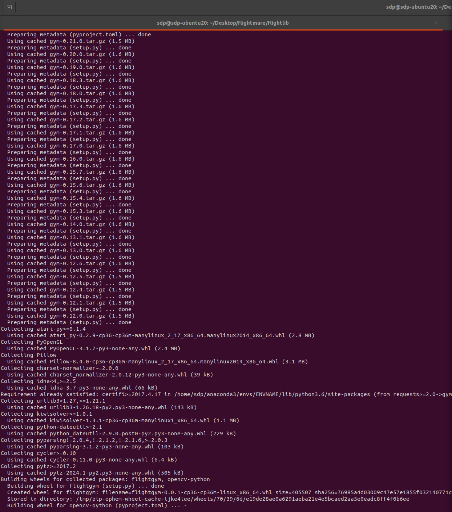
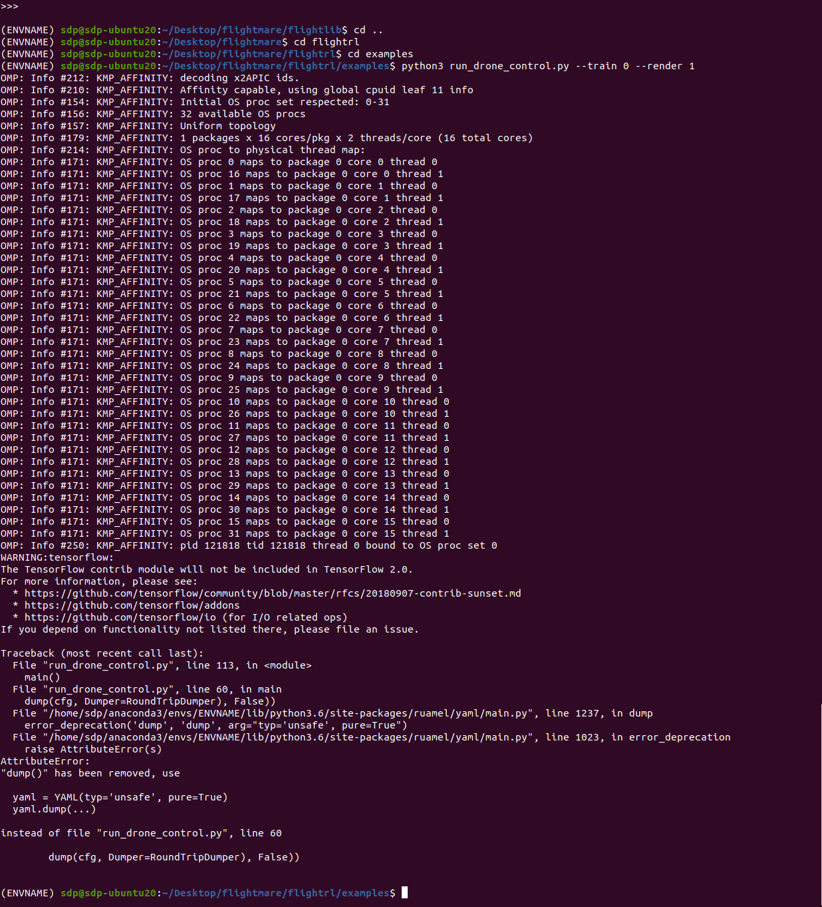

# Troubleshooting Guide

This guide provides solutions to common issues you might encounter while setting up and running the Flightmare simulator.

## Common Issues

### Lengthy Build Time for opencv-python Wheel:
**Symptom**: When trying to __install Flightmare__ using the commands below:

```
cd flightmare/flightlib
pip install .
```
Installing `OpenCV` within a Docker image took significantly longer than expected:

```
Building wheel for opencv-python (pyproject.toml) ... -
```
**Possible Cause**: 
Two problems were faced as listed below:

1. The installation process repeatedly downloads multiple versions of the `gym` package, indicating possible dependency resolution problems or version incompatibilities.

2. The installation encountered dependency conflicts between required versions of packages, which might have caused the installation process to take too long and not complete successfully.


**Solution**: 
- Running the `opencv-python` installation command with the `--verbose` flag to monitor progress closely which resloved the issue:

```
sudo pip install opencv-python --verbose
```

**Image for reference**:
 


### Error Running Drone Control Script: TensorFlow Warning and YAML Dump Issue:
**Symptom**: When attempting to run the `run_drone_control.py` script to run a provided test simulation of the drone using the commands below:

```
cd flightctrl
cd examples
python3 run_drone_control.py --train 0 --render 1
```
The following traceback error was encountered:

```

Traceback (most recent call last):
  File "run_drone_controltest.py", line 92, in <module>
    main()
  File "run_drone_controltest.py", line 52, in main
    yaml.dump(cfg), False))
  File "/home/sdp/anaconda3/envs/ENVNAME/lib/python3.6/site-packages/ruamel/yaml/main.py", line 591, in dump
    raise TypeError('Need a stream argument when not dumping from context manager')
TypeError: Need a stream argument when not dumping from context manager
```

**Possible Cause**: 
- The issue was caused by the incorrect usage of the `yaml.dump` method in the python script. The error message `TypeError: Need a stream argument when not dumping from context manager` indicated that yaml.dump requires a stream to write to when not used within a context manager.

**Solution**: 
To resolve this issue:

1. **Imported StringIO**: First, the `StringIO` class from the `io` module was imported. `StringIO` allows us to treat strings as file-like objects.

2. **Used StringIO for YAML Dump**: Instead of calling `yaml.dump(cfg)`, which caused the error, I used `yaml.dump(cfg, stream)` where `stream` is a `StringIO` object. This change provided a valid stream for `yaml.dump` to write the YAML content to.

3. **Passed YAML String to Environment**: After dumping the YAML configuration to `stream`, the string content of `stream` (`stream.getvalue()`) was passed to `QuadrotorEnv_v1` as its configuration parameter.


**Image for reference**:
 


## Frequently Asked Questions:

