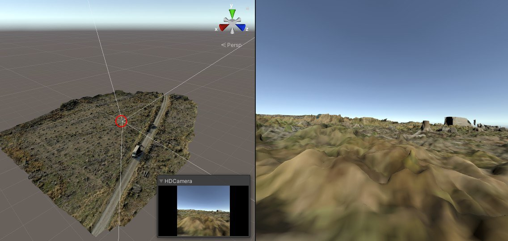

### Building and Customizing a Standalone Unity Project for Flightmare

Building the Flightmare Unity project into a standalone application is essential for enabling users to run and interact with quadrotor simulations independently on different platforms like Linux, Windows, and MacOS. This process ensures accessibility and usability without needing the Unity Editor, making it easier to distribute and use the simulation environment effectively. This guide is used to create the [unity project](https://flightmare.readthedocs.io/en/latest/building_flightmare_binary/standalone.html)

#### Installing Unity and Importing the Project

##### Install Unity Hub and Unity Editor

###### Prerequisites:
- **Install Unity Hub 2.0:** Recommended for Linux, Windows, or MacOS.
  - **Linux:** Download the AppImage and make it executable running the command below:
    ```bash
    chmod +x UnityHub.AppImage
    ```
  - **Windows/MacOS:** Download the installer from the [Unity website](https://unity.com/).

###### Steps:
1. **Launch Unity Hub:**
   - Open Unity Hub after installation.

2. **Find Installs:**
   - Navigate to the "Installs" section in Unity Hub.

3. **Add Unity Editor:**
   - Click "Add" and select Unity version 2020.1.10 or later.
   - Click "NEXT" and ensure "Linux Build Support" is selected if using Hub on Windows or MacOS.

4. **Complete Installation:**
   - Follow the prompts to complete the installation of the Unity Editor.

##### Get the Project

- Clone the Unity project to your local computer:
  ```bash
  git clone git@github.com:uzh-rpg/rpg_flightmare_unity.git
  ```


### Setting Up Unity Project for Linux Standalone Build

#### 1. Open and Configure Unity Project

1. **Open Unity Editor:**
   - Launch Unity Hub or directly open Unity Editor.

2. **Open Existing Project:**
   - Navigate to and open your cloned Unity project (`rpg_flightmare_unity`).

#### 2. Creating and Setting Up Scenes

1. **Create a New Scene:**
   - In Unity Editor, go to `File -> New Scene` to create a new scene.
   - Save the scene in `Assets/Scenes/` or a similar folder structure within your project.

2. **Configure Scene Settings:**
   - Adjust lighting, camera angles, and other scene settings as needed to achieve the desired visual and functional environment.

#### 3. Importing the 3D Model (Forest Floor Model)

The `.fbx format` is preferred for the `3D models` into `Unity and Flightmare` due to its broad compatibility, support for essential elements like geometry and animations, optimized performance within game engines, smooth integration into development workflows, and widespread acceptance as an industry standard, ensuring quality and facilitating collaboration across platforms.

1. **Import the 3D Model:**
   - Locate the `Forest Floor model` in `.fbx` format.
   - In `Unity Editor`, import the `.fbx model` into the project.
   - Place the model file into an appropriate folder (e.g., `Assets/Models/ForestFloor.fbx`).
   - While importing the model into unity you make encounter some warnings and erros IGNORRE it.

2. **Extract and Add Textures:**

      As textures did not automatically appear after importing the .fbx file into Unity in this case, it suggests that the textures were not embedded in the file or that Unity could not locate them. The textures have been manually added alongside the 3D model and the steps to do so can be found in  [Texture Extraction Steps](/docs/texture_extraction_steps.md).


3. **Create Prefab for the Model:**
   - Select the imported Forest Floor model in the Project window.
   - Right-click and choose "Create Prefab". This creates a prefab asset in `Assets/Resources/` for easy instantiation in scenes.
   - Ensure the prefab includes necessary components like colliders and textures.

#### 4. Configuring Build Settings for Linux Standalone

1. **Navigate to Build Settings:**
   - Go to `File -> Build Settings`.

2. **Set Target Platform:**
   - Select Linux under the "Platform" dropdown in Build Settings.

3. **Add Scenes to Build:**
   - Drag your created scene from the Scenes in Project window to the Scenes in Build window.
   - Ensure the correct scene is set as the main scene (`Top_Level_Scene`).

4. **Set Build Configuration:**
   - Choose `Windowed` for Fullscreen Mode.
   - Ensure Color Space is set to `Linear`.

#### 5. Build the Project

1. **Initiate Build:**
   - Click on the "Build" button in the Build Settings window.

2. **Ignore HDRP Warning:**
   - If prompted, ignore HDRP (High Definition Render Pipeline) warnings during the build process.

3. **Wait for Build Completion:**
   - The initial build may take a few minutes. Subsequent builds will be faster.

The forest floor model imported to the project will look like below, and the area marked with a red circle on the left image is where the camera is located, and the right is the camera view:

  .
