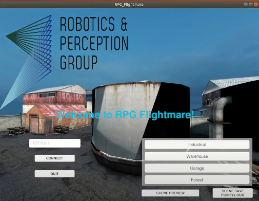
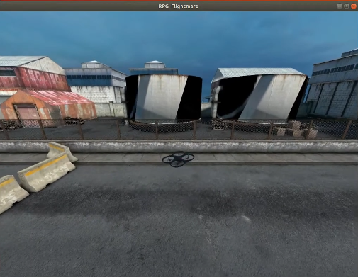

### Running the Flightmare simulator on the SSD and running a simple RL example on a drone


1. **Activate UEFI Mode:**
   - Ensure your system is set to UEFI mode boot. This can typically be done by accessing your BIOS settings:
     - Restart your computer and press the key (e.g., F2, Del) to enter BIOS setup.
     - Navigate to the Boot or Startup tab.
     - Select UEFI mode as the boot option rather than legacy BIOS mode.
     - Save and exit BIOS settings.

2. **Connect External SSD:**
   - Ensure the external SSD (installed in ICY BOX IB-200T-C3 enclosure via USB 3.2) is connected to your system.

3. **Boot into Ubuntu 20.04 from External SSD:**
   - Restart your computer and access BIOS setup again (if necessary).
   - Select the external SSD where Ubuntu 20.04 is installed as the boot device.
   - Save changes and exit BIOS settings to boot into Ubuntu 20.04 from the external SSD.

4. **Unity Rendering Setup:**
   - Once Ubuntu 20.04 is booted, Unity rendering for Flightmare is enabled by running the executable `RPG_Flightmare.x84-64` from the downloaded Flightmare binary. Double-click this executable in the `/home/sdp/Desktop/RPG_Flightmare` folder.

four   - Running the mentioned file, the `RPG_Flightmare` GUI will appear as below, on which four different 3D scenes `Industrial`, `Warehouse`, `Garage` and `Forest` can be chosen.
   
    

#### Running the RL Example Test

5. **Activate Conda Environment:**
   - Open a terminal in Ubuntu 20.04 and activate your Conda environment named `ENVNAME` where Flightmare is set up. Use:

     ```bash
     conda activate ENVNAME
     ```

6. **Navigate to Flightmare Directory:**
   - Change directory to where Flightmare is installed on the external SSD:

     ```bash
     cd /home/sdp/Desktop/flightmare/flightrl
     ```

7. **Run Sample Reinforcement Learning Script:**
   - Navigate to the examples directory:

     ```bash
     cd examples
     ```

   - Execute the sample script `run_drone_controltest.py` to run the simulator with a pre-trained controller. Use the following command:

     ```bash
     python3 run_drone_control.py --train 0 --render 1
     ```
    - Running the python code, a sample reinforcement learning (RL) training / testing algorithm will be run in the chosen environment (see the figure below):

        


      - And the the results of the simulation will be displayed as below: 


        


#### Additional Information

- **For detailed customization and troubleshooting:**
  - Check the `troubleshoot.md` file on the `docs/troubleshoot`branch.


### Building and Customizing a Standalone Unity Project for Flightmare


