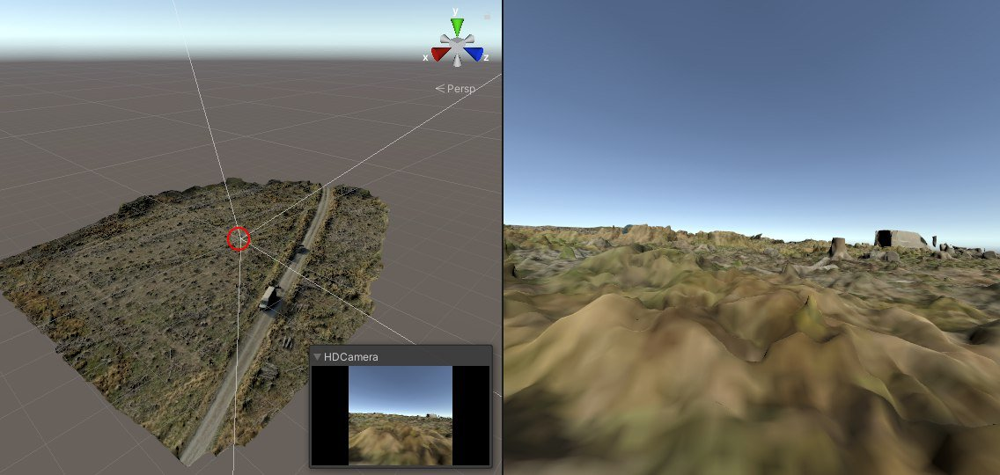
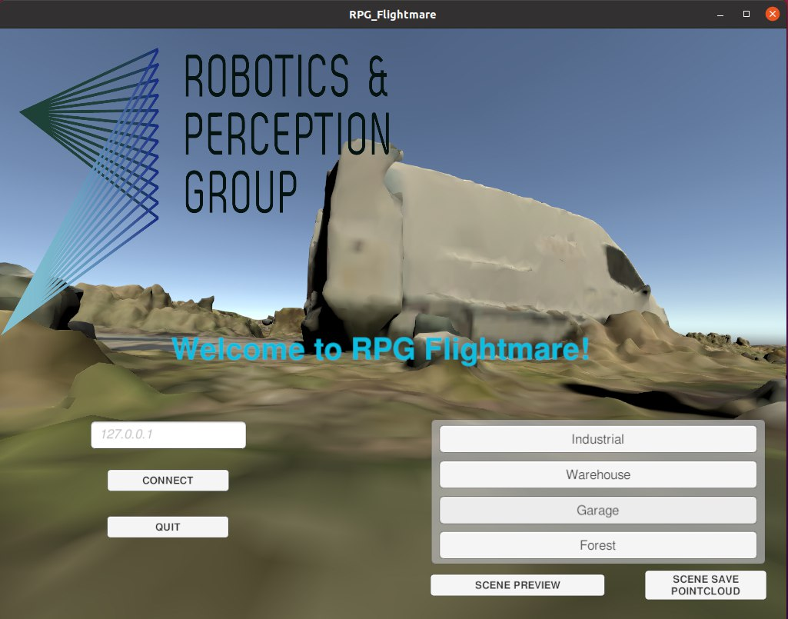
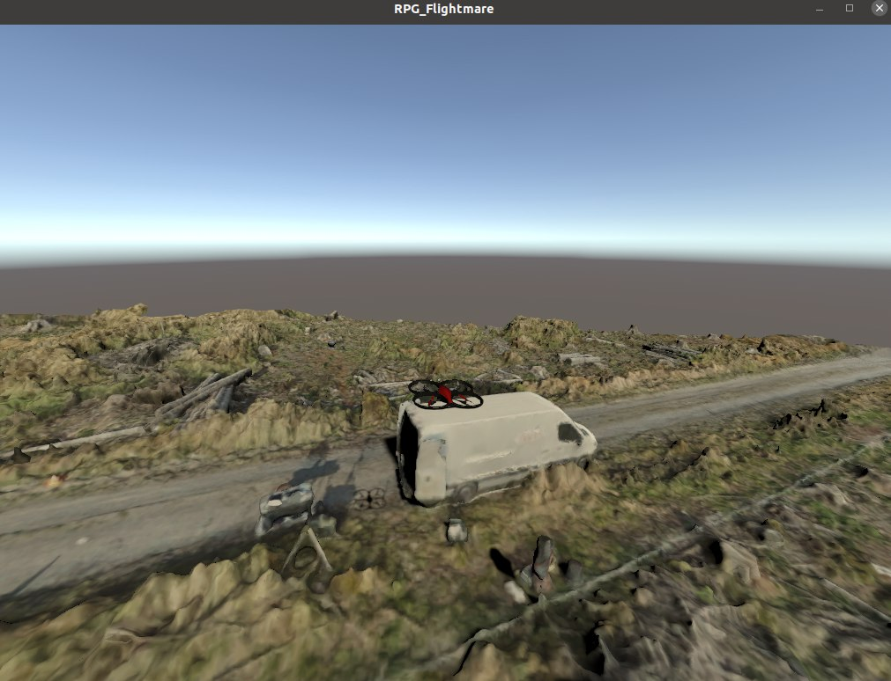
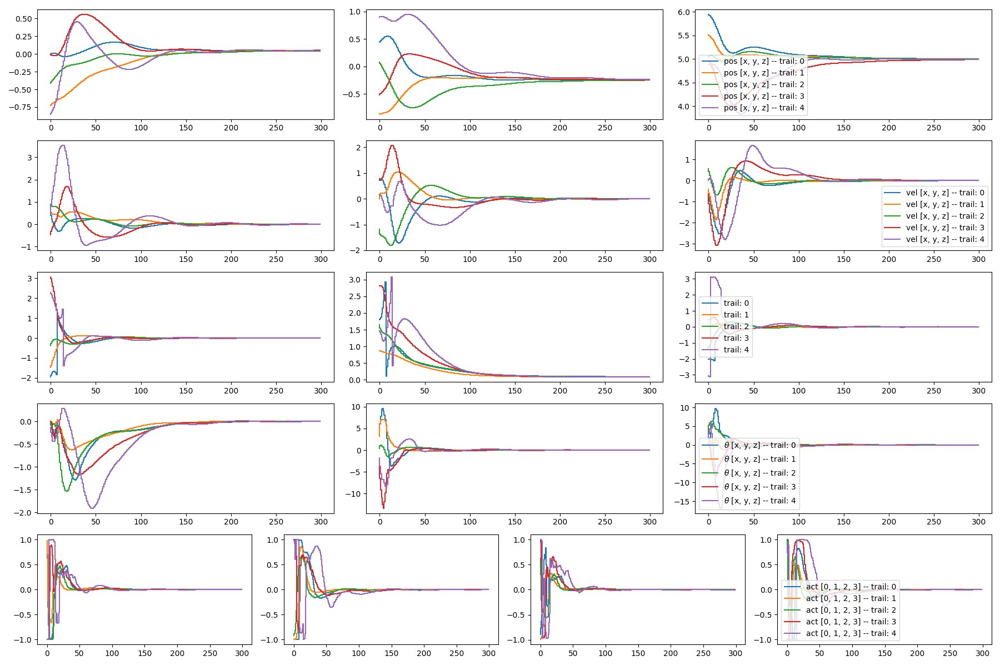

### Running the Flightmare simulator on the SSD and running a simple RL example on a drone


1. **Activate UEFI Mode:**
   - Ensure your system is set to UEFI mode boot. This can typically be done by accessing your BIOS settings:
     - Restart your computer and press the key (e.g., F2, Del) to enter BIOS setup.
     - Navigate to the Boot or Startup tab.
     - Select UEFI mode as the boot option rather than legacy BIOS mode.
     - Save and exit BIOS settings.

2. **Connect External SSD:**
   - Ensure the external SSD (installed in ICY BOX IB-200T-C3 enclosure via USB 3.2) is connected to your system.

3. **Boot into Ubuntu 20.04 from External SSD:**
   - Restart your computer and access BIOS setup again (if necessary).
   - Select the external SSD where Ubuntu 20.04 is installed as the boot device.
   - Save changes and exit BIOS settings to boot into Ubuntu 20.04 from the external SSD.

4. **Unity Rendering Setup:**
   - Once Ubuntu 20.04 is booted, Unity rendering for Flightmare is enabled by running the executable `RPG_Flightmare.x86_64` from the downloaded Flightmare binary. Double-click this executable in the `/home/sdp/Desktop/RPG_Flightmare` folder.

four   - Running the mentioned file, the `RPG_Flightmare` GUI will appear as below, on which four different 3D scenes `Industrial`, `Warehouse`, `Garage` and `Forest` can be chosen.
   
    

#### Running the RL Example Test
In this section the step to run the python RL simulation using the `default unity+flightmare` executable file and the `default 3D environments`.

5. **Activate Conda Environment:**
   - Open a terminal in Ubuntu 20.04 and activate your Conda environment named `ENVNAME` where Flightmare is set up. Use:

     ```bash
     conda activate ENVNAME
     ```

6. **Navigate to Flightmare Directory:**
   - Change directory to where Flightmare is installed on the external SSD:

     ```bash
     cd /home/sdp/Desktop/flightmare/flightrl
     ```

7. **Run Sample Reinforcement Learning Script:**
   - Navigate to the examples directory:

     ```bash
     cd examples
     ```

   - Execute the sample script `run_drone_controltest.py` to run the simulator with a pre-trained controller. Use the following command:

     ```bash
     python3 run_drone_controltest.py --train 0 --render 1
     ```
    - Running the python code, a sample reinforcement learning (RL) training / testing algorithm will be run in the chosen environment (see the figure below):

        


      - And the the results of the simulation will be displayed as below: 


        


#### Additional Information

- **For detailed customization and troubleshooting:**
  - Check the `troubleshoot.md` file on the `docs/troubleshoot`branch.

- -----------------------------------------
- -----------------------------------------
- -----------------------------------------
- -----------------------------------------
- -----------------------------------------

### Building and Customizing a Standalone Unity Project for Flightmare

Building the Flightmare Unity project into a standalone application is essential for enabling users to run and interact with quadrotor simulations independently on different platforms like Linux, Windows, and MacOS. This process ensures accessibility and usability without needing the Unity Editor, making it easier to distribute and use the simulation environment effectively.

#### Installing Unity and Importing the Project

##### Install Unity Hub and Unity Editor

###### Prerequisites:
- **Install Unity Hub 2.0:** Recommended for Linux, Windows, or MacOS.
  - **Linux:** Download the AppImage and make it executable running the command below:
    ```bash
    chmod +x UnityHub.AppImage
    ```
  - **Windows/MacOS:** Download the installer from the [Unity website](https://unity.com/).

###### Steps:
1. **Launch Unity Hub:**
   - Open Unity Hub after installation.

2. **Find Installs:**
   - Navigate to the "Installs" section in Unity Hub.

3. **Add Unity Editor:**
   - Click "Add" and select Unity version 2020.1.10 or later.
   - Click "NEXT" and ensure "Linux Build Support" is selected if using Hub on Windows or MacOS.

4. **Complete Installation:**
   - Follow the prompts to complete the installation of the Unity Editor.

##### Get the Project

- Clone the Unity project to your local computer:
  ```bash
  git clone git@github.com:uzh-rpg/rpg_flightmare_unity.git
  ```
- -----------------------------------------
- -----------------------------------------
- -----------------------------------------
- -----------------------------------------
- -----------------------------------------

### Setting Up Unity Project for Linux Standalone Build

#### 1. Open and Configure Unity Project

1. **Open Unity Editor:**
   - Launch Unity Hub or directly open Unity Editor.

2. **Open Existing Project:**
   - Navigate to and open your cloned Unity project (`rpg_flightmare_unity`).

#### 2. Creating and Setting Up Scenes

1. **Create a New Scene:**
   - In Unity Editor, go to `File -> New Scene` to create a new scene.
   - Save the scene in `Assets/Scenes/` or a similar folder structure within your project.

2. **Configure Scene Settings:**
   - Adjust lighting, camera angles, and other scene settings as needed to achieve the desired visual and functional environment.

#### 3. Importing the 3D Model (Forest Floor Model)

The `.fbx format` is preferred for the `3D models` into `Unity and Flightmare` due to its broad compatibility, support for essential elements like geometry and animations, optimized performance within game engines, smooth integration into development workflows, and widespread acceptance as an industry standard, ensuring quality and facilitating collaboration across platforms.

1. **Import the 3D Model:**
   - Locate the `Forest Floor model` in `.fbx` format.
   - In `Unity Editor`, import the `.fbx model` into the project.
   - Place the model file into an appropriate folder (e.g., `Assets/Models/ForestFloor.fbx`).

2. **Extract and Add Textures:**
   - Extract textures associated with the Forest Floor model separately.
   - Import the textures into Unity and place them in a folder alongside the model (e.g., `Assets/Textures/ForestFloorTextures/`).

3. **Create Prefab for the Model:**
   - Select the imported Forest Floor model in the Project window.
   - Right-click and choose "Create Prefab". This creates a prefab asset in `Assets/Resources/` for easy instantiation in scenes.
   - Ensure the prefab includes necessary components like colliders and textures.

#### 4. Configuring Build Settings for Linux Standalone

1. **Navigate to Build Settings:**
   - Go to `File -> Build Settings`.

2. **Set Target Platform:**
   - Select Linux under the "Platform" dropdown in Build Settings.

3. **Add Scenes to Build:**
   - Drag your created scene from the Scenes in Project window to the Scenes in Build window.
   - Ensure the correct scene is set as the main scene (`Top_Level_Scene`).

4. **Set Build Configuration:**
   - Choose `Windowed` for Fullscreen Mode.
   - Ensure Color Space is set to `Linear`.

#### 5. Build the Project

1. **Initiate Build:**
   - Click on the "Build" button in the Build Settings window.

2. **Ignore HDRP Warning:**
   - If prompted, ignore HDRP (High Definition Render Pipeline) warnings during the build process.

3. **Wait for Build Completion:**
   - The initial build may take a few minutes. Subsequent builds will be faster.

The forest floor model imported to the project will look like below, and the area marked with a red circle on the left image is where the camera is located, and the right is the camera view:

  .


- ------------------------
- ------------------------
- ------------------------
- ------------------------
- ------------------------

#### Running the RL Example Test on the `Forest Floor 3D model`

At this stage the RL simulation is run in the customized environment built using the forest floor model as explained above:

The steps to run the simulation are the same as the ones mentioned under the  [Running the Flightmare simulator on the SSD and running a simple RL example on a drone](#running-the-flightmare-simulator-on-the-ssd-and-running-a-simple-rl-example-on-a-drone) above, except for the part regarding the 4th step and the below instruction should be followed instead:

4. **Unity Rendering Setup:**
   - Once Ubuntu 20.04 is booted, Unity rendering for Flightmare is enabled by running the executable `forest26_06.x86_64` under the directory: `/Desktop/flightmare/flightrl/examples`

  - The UI will look like below:

   .

 - And the drone during the simulation will look like below:

    

   - And the the results of the simulation will be displayed as below: 


    


