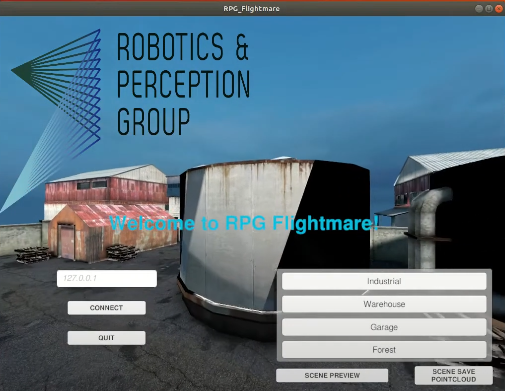
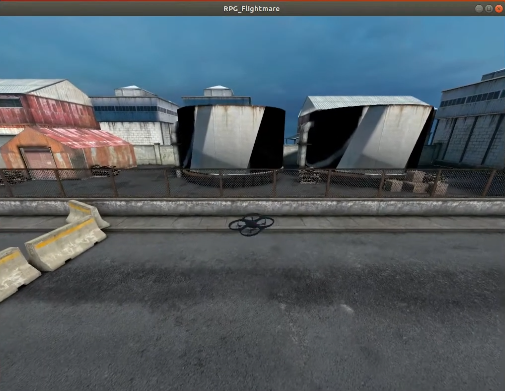
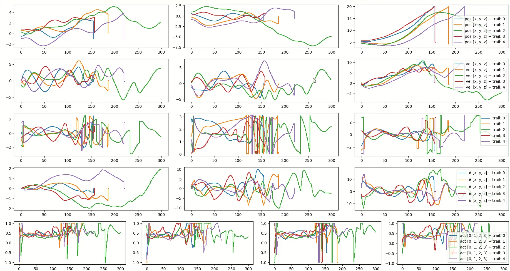
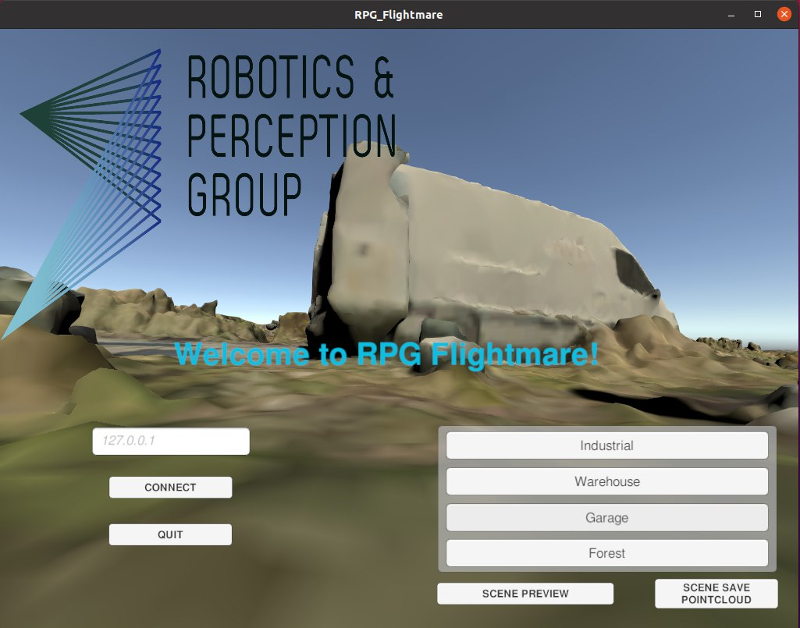
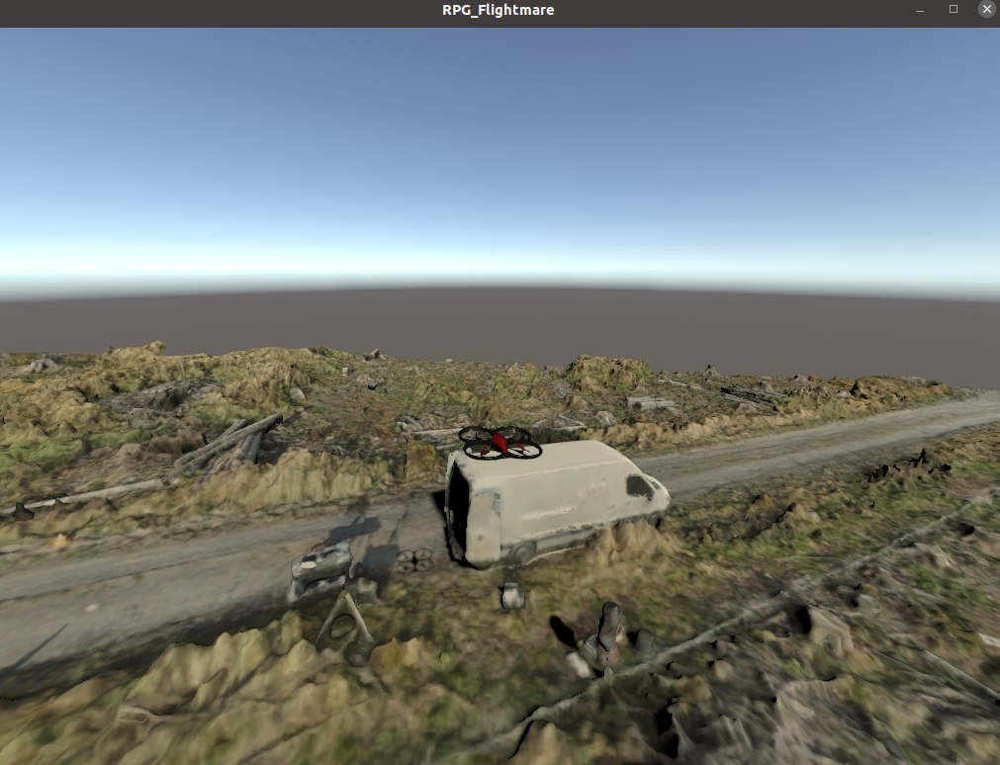
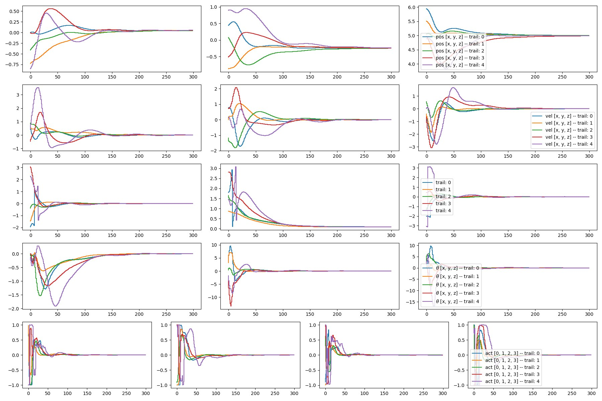

### Running the Flightmare simulator on the SSD and running a simple RL example on a drone


1. **Activate UEFI Mode:**
   - Ensure your system is set to UEFI mode boot. This can typically be done by accessing your BIOS settings:
     - Restart your computer and press the key (e.g., F2, Del) to enter BIOS setup.
     - Navigate to the Boot or Startup tab.
     - Select UEFI mode as the boot option rather than legacy BIOS mode.
     - Save and exit BIOS settings.
       
     **⚠️ WARNING :- BE CAREFULL WHILE CHANGING BOOT MODE FROM LEGACY TO UEFI IN CASE IF YOU HAVE TO DO IT. YOU MAY LOOSE ALL FILES IN YOUR SYSTEM**

2. **Connect External SSD:**
   - Ensure the external SSD (installed in ICY BOX IB-200T-C3 enclosure via USB 3.2) is connected to your system.

3. **Boot into Ubuntu 20.04 from External SSD:**
   - Restart your computer and access BIOS setup again (if necessary).
   - Select the external SSD where Ubuntu 20.04 is installed as the boot device.
   - Save changes and exit BIOS settings to boot into Ubuntu 20.04 from the external SSD.

4. **Unity Rendering Setup:**
   - Once Ubuntu 20.04 is booted, Unity rendering for Flightmare is enabled by running the executable `RPG_Flightmare.x86_64` from the downloaded Flightmare binary. Double-click this executable in the `/home/sdp/Desktop/RPG_Flightmare` folder.

four   - Running the mentioned file, the `RPG_Flightmare` GUI will appear as below, on which four different 3D scenes `Industrial`, `Warehouse`, `Garage` and `Forest` can be chosen.
   
    

#### Running the RL Example Test
In this section the step to run the python RL simulation using the `default unity+flightmare` executable file and the `default 3D environments`.

5. **Activate Conda Environment:**
   - Open a terminal in Ubuntu 20.04 and activate your Conda environment named `ENVNAME` where Flightmare is set up. Use:

     ```bash
     conda activate ENVNAME
     ```

6. **Navigate to Flightmare Directory:**
   - Change directory to where Flightmare is installed on the external SSD:

     ```bash
     cd /home/sdp/Desktop/flightmare/flightrl
     ```

7. **Run Sample Reinforcement Learning Script:**
   - Navigate to the examples directory:

     ```bash
     cd examples
     ```

   - Execute the sample script `run_drone_controltest.py` to run the simulator with a pre-trained controller. Use the following command:

     ```bash
     python3 run_drone_controltest.py --train 0 --render 1
     ```
    - Running the python code, a sample reinforcement learning (RL) training / testing algorithm will be run in the chosen environment (see the figure below):

        


      - And the the results of the simulation will be displayed as below: 


        


#### Additional Information

- **For detailed customization and troubleshooting:**
  - Check the `troubleshoot.md` file on the `docs/troubleshoot`branch.


## Running the ROS Example Test
Once everting is installed sucuessfully and Catkin build is succesful.
- **Build examples in Flightros**
  ```
  catkin build flightros -DBUILD_SAMPLES:=ON
  ```
- **Launch example**
```
roslaunch flightros rotors_gazebo.launch
```

#### Running the RL Example Test on the `Forest Floor 3D model`

The steps to run the simulation are the same as the ones mentioned under the  [Running the Flightmare simulator on the SSD and running a simple RL example on a drone](#running-the-flightmare-simulator-on-the-ssd-and-running-a-simple-rl-example-on-a-drone) above, except for the part regarding the 4th step and the below instruction should be followed instead:

4. **Unity Rendering Setup:**
   - Once Ubuntu 20.04 is booted, Unity rendering for Flightmare is enabled by running the executable `forest26_06.x86_64` under the directory: `/Desktop/flightmare/flightrl/examples`

  - The UI will look like below:

   .

 - And the drone during the simulation will look like below:

    

   <!-- - And the the results of the simulation will be displayed as below: > -->


  <!--  -->
   


